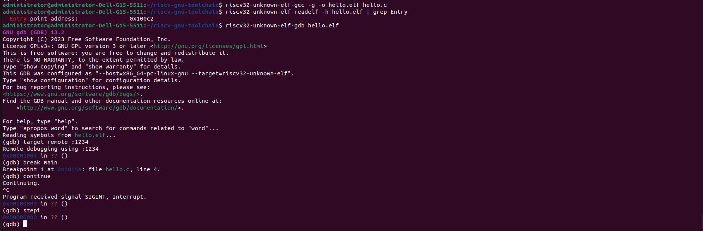

# vsdRiscvSoc
## Task:1 How to Install and Unpack the RISC-V Toolchain
Installation guide for the RISC-V GNU toolchain targeting RV64 bare-metal systems. This version fixes common build errors and includes essential troubleshooting steps.
# 1 Prerequisites

```bash
#Ubuntu
sudo apt update
sudo apt install autoconf automake autotools-dev curl python3 
```
# 2 Corrected Installation Steps
## 2.1 Create Workspace
```bash
export WORKSPACE=$HOME/riscv-toolchain
mkdir -p $WORKSPACE
cd $WORKSPACE
```
## 2.2 Clone Repository with Fixes
```bash
git clone --depth 1 --branch 2024.04.05\
https :// github . com / riscv -collab / riscv -gnu -toolchain . git
cd riscv -gnu -toolchain
git submodule update --init --recursive --depth 1 --jobs 8
```
## 2.3 Configure with Fixed Parameters
```bash
./configure --prefix=/opt/riscv64 - elf \
--with -arch=rv64imac \
--with -abi=lp64 \
--with -cmodel=medany \
--with -newlib \
--without -headers \
--disable -shared \
--disable -threads \
--disable -gdb \
--disable -libssp \
--disable -libquadmath
```
##  2.4 Build with Fixed Parallelism
```bash
PARALLEL_JOBS =$(($(nproc)/2))
make -j$PARALLEL_JOBS
sudo make install
```
## 2.5 Environment Setup with Verification
```bash
echo ’ export PATH=/opt/riscv64 -elf/ bin : $PATH ’ >> ~/.bashrc
source ~/.bashrc
riscv64 -unknown -elf -gcc --version
```
# 3 Critical Troubleshooting Section
# Fix common build failures:
## 3.1 Submodule Fixes
```bash
cd riscv -gnu -toolchain
git submodule deinit -f .
git submodule update --init --recursive --depth 1 --jobs 8
```
## 3.2 Memory Error Fix
```bash
sudo fallocate -l 8G /swapfile
sudo chmod 600 /swapfile
sudo mkswap /swapfile
sudo swapon /swapfile
```
## 3.3 Compiler Error Fix
```bash
export CXXFLAGS ="-O1"
make clean
make -j$PARALLEL_JOBS
```
## 3.4 Missing Header Fix
```bash
sudo ln -s / usr / include / x86_64 -linux -gnu / bits / usr / include / bits
sudo ln -s / usr / include / x86_64 -linux -gnu / gnu / usr / include / gnu
sudo ln -s / usr / include / x86_64 -linux -gnu / sys / usr / include / sys
```
# 4 Test Toolchain with Fixed Example
```bash
cat > test .c << EOF
int _start () {
return 0;
}
EOF
riscv64 -unknown -elf -gcc -march = rv64imac -mabi = lp64 \
-mcmodel = medany -nostartfiles - ffreestanding \
-Wl ,-Ttext =0 x80000000 -o test . elf test . c
file test . elf
```


# Task2: Compile “Hello, RISC-V” 
“Show me a minimal C ‘hello world’ that cross-compiles for RV32IMC and the exact gcc
flags to produce an ELF.”
# AI Response
hello.c code
```c
/ Minimal bare-metal RISC-V UART output
#define UART_BASE 0x10000000  // Standard QEMU virt machine UART address

void uart_putc(char c) {
    volatile char *uart = (volatile char *)UART_BASE;
    *uart = c;
}


void uart_puts(const char *s) {
    while (*s) {
        uart_putc(*s++);
    }
}

int main() {
    uart_puts("Hello, RISC-V World!\n");
    return 0;
}

void _start() {
    main();
    while (1);  // Halt CPU
}
```
link.ld code
```c
NTRY(_start)

MEMORY {
    RAM (rwx) : ORIGIN = 0x80000000, LENGTH = 128K
}

SECTIONS {
    .text : {
        *(.text._start)
        *(.text*)
    } > RAM

    .data : { *(.data*) } > RAM
    .bss : { *(.bss*) } > RAM
    _end = .;
}
```
Build Commands
```bash
riscv64-unknown-elf-gcc -march=rv32imac -mabi=ilp32 \
    -nostdlib -ffreestanding -Tlink.ld \
    -o hello.elf hello.c

# Convert to raw binary (optional)
riscv64-unknown-elf-objcopy -O binary hello.elf hello.bin
```
### Key Details:
### UART Address:
0x10000000 is standard for QEMU's virt machine
Change if targeting different hardware
### Memory Map:
Text section starts at 0x80000000 (common RISC-V boot address)
128KB RAM is sufficient for this example
### Bare-Metal Essentials:
No standard library (-nostdlib)
No CRT startup (-ffreestanding)
Custom _start that calls main()
### To Run in QEMU:
```bash
qemu-system-riscv32 -nographic -machine virt \
    -bios none -kernel hello.elf
```
### Expected Output:

# Task:3 From C to Assembly
## How do I generate the .s file and explain the prologue/epilogue of the main function?
### 1. Generate Assembly File (.s)
Use GCC with -S flag to produce assembly output:
```bash
riscv64-unknown-elf-gcc -S -march=rv32imac -mabi=ilp32 -O0 hello.c -o hello.s
```
- -S: Stop after generating assembly (instead of object/ELF files)
- -O0: Disable optimizations (for clearer prologue/epilogue)
### 2. Assembly Output (Main Function)
###  uart_putc Function (Address: 0x80000000)
```asm
80000000:	7179                	addi	sp,sp,-48      # Allocate 48 bytes stack space
80000002:	d622                	sw	s0,44(sp)      # Save frame pointer (s0) on stack
80000004:	1800                	addi	s0,sp,48      # Set new frame pointer (s0 = sp + 48)
80000006:	87aa                	mv	a5,a0         # Move char argument (a0) to a5
80000008:	fcf40fa3          	sb	a5,-33(s0)    # Store char on stack (byte)
8000000c:	100007b7          	lui	a5,0x10000    # Load UART base addr (0x10000 << 12)
80000010:	fef42623          	sw	a5,-20(s0)    # Store UART addr on stack
80000014:	fec42783          	lw	a5,-20(s0)    # Reload UART addr
80000018:	fdf44703          	lbu	a4,-33(s0)   # Load char from stack
8000001c:	00e78023          	sb	a4,0(a5)      # Write char to UART (*(a5) = a4)
80000020:	0001                	nop             # No-operation (padding)
80000022:	5432                	lw	s0,44(sp)    # Restore frame pointer
80000024:	6145                	addi	sp,sp,48    # Deallocate stack
80000026:	8082                	ret             # Return
```
### Key Points:
- Stack frame is oversized (48 bytes) due to -O0 (no optimizations)
- UART address (0x10000000) is loaded in two steps:
1. lui loads upper 20 bits
2. sb stores the byte to the UART
### uart_puts Function (Address: 0x80000028)
```asm
80000028:	1101                	addi	sp,sp,-32    # Allocate 32 bytes stack
8000002a:	ce06                	sw	ra,28(sp)     # Save return address
8000002c:	cc22                	sw	s0,24(sp)     # Save frame pointer
8000002e:	1000                	addi	s0,sp,32     # Set new frame pointer
80000030:	fea42623          	sw	a0,-20(s0)    # Store string pointer on stack
80000034:	a819                	j	8000004a      # Jump to loop condition (first time)
80000036:	fec42783          	lw	a5,-20(s0)    # Load string pointer
8000003a:	00178713          	addi	a4,a5,1      # Increment pointer (a7 = a5 + 1)
8000003e:	fee42623          	sw	a4,-20(s0)    # Store updated pointer
80000042:	0007c783          	lbu	a5,0(a5)     # Load current char (a5 = *a5)
80000046:	853e                	mv	a0,a5        # Move char to a0 (argument)
80000048:	3f65                	jal	80000000     # Call uart_putc (PC-relative)
8000004a:	fec42783          	lw	a5,-20(s0)    # Load string pointer
8000004e:	0007c783          	lbu	a5,0(a5)     # Load current char
80000052:	f3f5                	bnez	a5,80000036  # Loop if char != '\0'
80000054:	0001                	nop             # Padding
80000056:	0001                	nop             # Padding
80000058:	40f2                	lw	ra,28(sp)    # Restore return address
8000005a:	4462                	lw	s0,24(sp)    # Restore frame pointer
8000005c:	6105                	addi	sp,sp,32    # Deallocate stack
8000005e:	8082                	ret             # Return
```
### Loop Structure:
1. Initialization: Jump directly to condition check (0x8000004a)
2. Body: Load char ‚Üí print ‚Üí increment pointer (0x80000036-0x80000048)
3. Condition: Check for null terminator (0x8000004a-0x80000052)
### main Function (Address: 0x80000060)
```asm
80000060:	1141                	addi	sp,sp,-16    # Allocate 16 bytes stack
80000062:	c606                	sw	ra,12(sp)     # Save return address
80000064:	c422                	sw	s0,8(sp)      # Save frame pointer
80000066:	0800                	addi	s0,sp,16     # Set frame pointer
80000068:	800007b7          	lui	a5,0x80000    # Load upper bits of string addr
8000006c:	08c78513          	addi	a0,a5,140    # a0 = 0x8000008c (string addr)
80000070:	3f65                	jal	80000028     # Call uart_puts
80000072:	4781                	li	a5,0         # Load return value (0)
80000074:	853e                	mv	a0,a5        # Move to return register (a0)
80000076:	40b2                	lw	ra,12(sp)    # Restore return address
80000078:	4422                	lw	s0,8(sp)     # Restore frame pointer
8000007a:	0141                	addi	sp,sp,16    # Deallocate stack
8000007c:	8082                	ret             # Return
```
### String Address Calculation:
- 0x8000008c points to the stored string in memory (not shown in disassembly)
- lui + addi is RISC-V's way to load 32-bit addresses
### _start Entry Point (Address: 0x8000007e)
```asm
8000007e:	1141                	addi	sp,sp,-16    # Allocate stack (unused)
80000080:	c606                	sw	ra,12(sp)     # Save ra (unnecessary)
80000082:	c422                	sw	s0,8(sp)      # Save s0 (unnecessary)
80000084:	0800                	addi	s0,sp,16     # Set frame pointer
80000086:	3fe9                	jal	80000060     # Call main (PC-relative)
80000088:	a001                	j	80000088      # Infinite loop (halt)
```
### Bare-Metal Behavior:
- The j 80000088 creates an infinite loop (replaces OS exit)
- Stack setup is redundant (no caller to return to)
### Key Observations
1. ### Stack Usage:
- Each function creates its own stack frame
- Callee-saved registers (ra, s0) are preserved
2. ### PC-Relative Jumps:
- jal uses relative addressing (3f65 = jump to 0x80000000)
3. ### Inefficiencies:
- Redundant loads/stores due to -O0
- Unnecessary stack ops in _start
4. ### Memory Layout:
- Code starts at 0x80000000 (common RISC-V boot address)
- String likely at 0x8000008c (visible in full objdump)

# Task:4 Hex Dump & Disassembly
## Show me how to turn my ELF into a raw hex and to disassemble it with objdump. What do each columns mean?
### 1. Convert ELF to Raw Binary (Hex)
```bash
riscv64-unknown-elf-objcopy -O binary hello.elf hello.bin
```
- -O binary: Output format (raw binary)
- Result: hello.bin (contains only executable code/data, no headers)
### To view hexdump:
```bash
hexdump -v -e '4/1 "%02x " "\n"' hello.bin
```
### output:

### 2. Disassemble the ELF File
```bash
riscv64-unknown-elf-objdump -d hello.elf
```
### output (with column explanations):

### Column Breakdown:
1. ### Address: 80000000
- Memory address where the instruction is loaded.
2. ### Opcode: 7179
- 16-bit compressed instruction (RV32IC). Full 32-bit instructions show 8 hex digits.
3. ### Mnemonic: addi sp,sp,-48
- Human-readable assembly.
- Format: OPCODE DEST, SRC, IMMEDIATE
4. ### Comment: # [1] [2] [3] [4]
- Added manually to explain:
- [1] = Stack pointer adjustment
- [2] = Store operation
- [3] = Frame pointer setup
- [4] = Function body
### 3. Disassemble Raw Binary
```bash
riscv64-unknown-elf-objdump -D -b binary -m riscv:rv32 -M no-aliases hello.bin
```
- -D: Disassemble all sections
- -m riscv:rv32: Target architecture
- -M no-aliases: Show raw instructions (e.g., c.addi instead of addi)
### Output:

### 4. Key objdump Flags
| Flag          | Purpose                         |
|------------------|-------------------------------------|
| -d       | Disassemble only code sections   |
| -S        | Mix source with disassembly (requires -g at compile)             |
| -t        | Show symbols  |
| -h  | Section headers         |
| -j .text  | Focus on specific section             |
# Task:5 ABI & Register Cheat-Sheet
### List all 32 RV32 integer registers with their ABI names and typical calling-convention roles.
### RV32 Integer Registers & Calling Convention
| Register   | ABI Name   | Description                          | Caller/Callee-Saved | Typical Use                     |
|------------|------------|--------------------------------------|----------------------|----------------------------------|
| x0         | zero       | Hardwired zero                       | -                    | Constant 0, discard results      |
| x1         | ra         | Return address                       | Caller               | Stores `jal` return address      |
| x2         | sp         | Stack pointer                        | Callee               | Points to stack                  |
| x3         | gp         | Global pointer                       | -                    | Rarely used global base pointer  |
| x4         | tp         | Thread pointer                       | -                    | Thread-local storage pointer     |
| x5–x7      | t0–t2      | Temporary registers                  | Caller               | Scratch registers                |
| x8         | s0/fp      | Saved register / Frame pointer      | Callee               | Base address of current frame    |
| x9         | s1         | Saved register                       | Callee               | Preserved across calls           |
| x10–x11    | a0–a1      | Function arguments / Return values  | Caller               | Args 1–2, return values          |
| x12–x17    | a2–a7      | Function arguments                  | Caller               | Args 3–8                         |
| x18–x27    | s2–s11     | Saved registers                      | Callee               | Preserved across calls           |
| x28–x31    | t3–t6      | Temporary registers                  | Caller               | Additional scratch registers     |
### Key Calling Convention Rules
1. ### Caller-Saved (Volatile):
- ra, t0-t6, a0-a7
- Can be modified by called functions (save if needed after call).
2. ### Callee-Saved (Non-Volatile):
- sp, s0-s11
- Must be preserved by called functions (save/restore if modified).
3. ### Special Cases:
- a0-a1: Hold return values (only a0 for 32-bit values).
- sp: Must be identical on function exit.
- ra: Contains return address (overwritten by jal).
# Task:6 Stepping with GDB
### Start QEMU in another terminal with debugging enabled
```bash
qemu-system-riscv32 -nographic -machine sifive_e -kernel hello.elf -S -gdb tcp::1234
```
### Connect GDB to QEMU 
```bash
riscv32-unknown-elf-gdb hello.elf
```
Inside the GDB
```bash
(gdb) target remote :1234
```
Output
```bash
Remote debugging using :1234
0x00001004 in ?? ()
```
### Set breakpoint at main and continue
```bash
(gdb) break main
Breakpoint 1 at 0x1014a: file hello.c, line 4.
(gdb) continue
```
Problem: At this point, QEMU consistently froze after hitting "continue".<br>
Attempting to interrupt using Ctrl+C resulted in:
```bash
Program received signal SIGINT, Interrupt.
0x00000000 in ?? ()
```
Stepping through with stepi stayed stuck at 0x00000000:
```bash
(gdb) stepi
0x00000000 in ?? ()
```
### Output


# Task:7 Running Under an Emulator
Run your bare-metal RISC-V ELF program using an emulator like Spike or QEMU, and view the output through the UART console. This is especially useful when real hardware is not available.
### Compile your bare-metal program with debug symbols
Use the following command to compile your C program (hello.c) with the linker script (linker.ld) and include debug info:
```bash
riscv32-unknown-elf-gcc -g -nostdlib -nostartfiles -T linker.ld -o hello.elf hello.c
```
### Run the ELF using QEMU
Use QEMU's RISC-V system emulator to run your ELF and get UART output: 
```bash
qemu-system-riscv32 -nographic -machine sifive_e -kernel hello.elf
```
###  Debugging using GDB with QEMU
Start QEMU with GDB server enabled:
```bash
qemu-system-riscv32 -nographic -machine sifive_e -kernel hello.elf -S -gdb tcp::1234
```
In another terminal, start GDB:
```bash
riscv32-unknown-elf-gdb hello.elf
```
Connect to QEMU's GDB server:
```bash
(gdb) target remote :1234
```
info registers Shows the current values of CPU registers (e.g., ra, sp, gp, a0, etc.)

disassemble or disassemble Shows the assembly instructions around the program counter or for a specific function

# Task:8 Exploring GCC Optimisation
### Question:
“Compile the same file with -O0 vs -O2. What differences appear in the assembly and why?”
### Goal
To analyze how different GCC optimization levels impact the generated assembly code by comparing the outputs of:
- -O0: No optimization (preserves structure, useful for debugging)
- -O2: Enables aggressive optimizations for performance and efficiency
### Write a test C program
```c
// File: opt.c
int square(int x) {
    return x * x;
}

int unused_function() {
    int y = 100;
    return y;
}

int main() {
    int a = 10;
    int b = square(a);
    return b;
}
```
### Compile with -O0 (no optimization)
```bash
riscv32-unknown-elf-gcc -S -O0 opt.c -o opt_O0.s
```
This generates a verbose .s file with all functions and minimal optimization.
### Step 3: Compile with -O2 (optimized)
```bash
riscv32-unknown-elf-gcc -S -O2 opt.c -o opt_O2.s
```
This will inline small functions, eliminate unused ones, and use registers more efficiently.
### Compare the two versions
```bash
diff opt_O0.s opt_O2.s
```
# üß™ GCC Optimization Levels: `-O0` vs `-O2`

This project demonstrates how different GCC optimization levels (`-O0` vs `-O2`) affect the generated assembly code in RISC-V or any other target architecture.

---

## ⚙️ What is the difference between `-O0` and `-O2`?

| Flag  | Optimization Level | Description                                                                 |
|--------|--------------------|-----------------------------------------------------------------------------|
| `-O0` | None               | No optimization. Compiler preserves code structure, useful for debugging.   |
| `-O2` | High               | Aggressive optimizations for performance without significantly increasing binary size. |

---

## üîç What differences appear in the assembly?

### ‚úÖ With `-O0`:
- The assembly is **longer** and more **verbose**.
- All variables are **stored in memory** (RAM/stack), not registers.
- **No instruction reordering** or **dead code elimination**.
- **Function calls** are not inlined.
- Easier to map each C line to assembly — **good for debugging**.

### ‚úÖ With `-O2`:
- The assembly is **shorter**, **faster**, and more **efficient**.
- **Unused variables** and **redundant operations** are removed.
- **Smarter register allocation** — fewer memory accesses.
- **Loops** may be **unrolled** or **strength-reduced**.
- **Function inlining** replaces small function calls with their code.
- **Instruction scheduling** improves performance through reordering.

---

## 🤔 Why do these differences occur?

The `-O2` flag enables multiple optimization passes in GCC, such as:

- 🔄 **Constant folding** – Compute values at compile-time.
- ✂️ **Dead code elimination** – Remove unused code.
- 🔁 **Loop invariant code motion** – Move static computations out of loops.
- 📦 **Common subexpression elimination** – Avoid redundant calculations.
- ➕ **Inlining** – Replace function calls with actual code.
- 🔧 **Peephole optimization** – Simplify small instruction patterns.

---

## 🧠 Summary

| Aspect             | `-O0`            | `-O2`           |
|--------------------|------------------|-----------------|
| Speed              | Slow             | Fast            |
| Code Size          | Large            | Compact         |
| Debugging          | Easy             | Harder          |
| Optimization       | None             | High            |
| Variable Location  | Mostly memory    | Mostly registers|
| Function Calls     | As-is            | Often inlined   |

---

## 📂 How to Try

```bash
# Compile with no optimization
riscv32-unknown-elf-gcc -O0 -S test.c -o test_O0.s

# Compile with -O2 optimization
riscv32-unknown-elf-gcc -O2 -S test.c -o test_O2.s
```
### My Code
GCC Optimisation 

# Task9: Inline Assembly Basics
### Goal
To write a function in C that returns the current value of the RISC-V cycle counter by accessing CSR register 0xC00 using inline assembly.
### C Function Code

### Explanation of Each Part
### üßæ Inline Assembly in RISC-V: Reading Cycle Count using `rdcycle`
### üìå Explanation of Constraints

### üß± `volatile` Keyword
- Prevents the compiler from optimizing out or reordering the inline assembly block.
- Ensures the block executes **exactly where it appears** in the C code.

---

### 🧮 `rdcycle %[cycles]`
- `rdcycle` is the **RISC-V instruction** used to read the **Cycle CSR** (`0xC00`).
- `%[cycles]` refers to the named **output operand** that receives the value.

---

### üßæ Output Operand: `[cycles] "=r" (cycles)`

| Component      | Meaning                                                |
|----------------|--------------------------------------------------------|
| `[cycles]`     | Symbolic name used inside the `asm` block              |
| `"=r"`         | GCC constraint:                                        |
| `=`            | Indicates a **write-only** operand                     |
| `r`            | Use a **general-purpose register**                     |
| `(cycles)`     | The **C variable** where the result will be stored     |

---

### üö´ No Input Operands
- The input section of the `asm` block is empty (`:`) because the `rdcycle` instruction only **reads** the CSR and does not require any inputs.

---

### üîí No Clobbers
- The clobber section is also empty (`:`) since this assembly:
  - Does **not modify memory**.
  - Does **not use special registers** beyond the declared output.

---

## ‚úÖ Example Inline Assembly

```c
uint32_t c;
asm volatile ("csrr %0, cycle" : "=r"(c));
```
# Task:10 Memory-Mapped I/O Demo
“Show a bare-metal C snippet to toggle a GPIO register located at 0x10012000. How do I prevent the compiler from optimizing the store away?”
### Code

### Explanation
### üìå Key Concepts
### üîí `volatile`
- Informs the compiler **not to optimize** accesses to the variable.
- Essential when working with **hardware registers** or **memory-mapped I/O**.
- Without `volatile`, the compiler might **skip or reorder** access because it doesn't see any effect on normal program logic.

---

### üßæ `(uint32_t *) 0x10012000`
- This **casts the GPIO base address** to a pointer of type `uint32_t *`.
- Assumes the hardware register is **32-bit wide** (i.e., 4 bytes).

---

### 🖊️ `*gpio = 0x1;`
- Writes the value `0x1` directly to the GPIO register.
- This action could, for example, **set or turn ON a specific output pin**.

---

### üìê Alignment
- The address `0x10012000` is **4-byte aligned** (divisible by 4).
- This is important because many systems require proper alignment for `uint32_t` access to avoid faults or undefined behavior.

---

### ‚úÖ Example Code

```c
#define GPIO_ADDR 0x10012000

void gpio_on() {
    volatile uint32_t *gpio = (volatile uint32_t *) GPIO_ADDR;
    *gpio = 0x1;  // Set pin or write to GPIO register
}
```
# Task:11 Linker Script 101
“Provide a minimal linker script that places .text at 0x00000000 and .data at 0x10000000 for RV32IMC.”
### Minimal Linker Script

### üí° Why Flash and SRAM Addresses Differ

In embedded systems, Flash and SRAM are two fundamental types of memory, each serving different purposes and accessed through different address ranges.

---

### 1. üßä Different Physical Memories

Flash and SRAM are **physically separate** memory components on a microcontroller or SoC.

| Memory Type | Description |
|-------------|-------------|
| **Flash**   | Non-volatile — retains data even after power-off. Typically used for **program instructions and constants**. |
| **SRAM**    | Volatile — data is lost when power is off. Used for **temporary data** like the **stack, heap, and global variables**. |

---

### 2. 🗺️ Memory Map Design

- The CPU uses **memory-mapped addressing** to access both Flash and SRAM.
- Each memory type is mapped to a **different address range**, set by the **chip's memory map**.

üìç **Example (RISC-V / ARM Cortex-M)**

```text
Flash:  0x00000000 – 0x0003FFFF
SRAM:   0x20000000 – 0x2000FFFF
```
# Task:12 Start-up Code & crt0
### Question
“What does crt0.S typically do in a bare-metal RISC-V program and where do I get one?”
## üìò What is `crt0.S`?
`crt0` stands for **"C RunTime zero"** — it is the **first code executed before your `main()` function** in embedded or bare-metal systems.

- `.S` indicates it's a **preprocessed assembly file**.
- It is responsible for setting up the minimal runtime environment required to execute C code.

---

## üîß Responsibilities of `crt0.S`

Here’s what typically happens inside `crt0.S`:

### 1️⃣ Reset Handler / Entry Point
Defines the **reset vector**, which is the first address the CPU jumps to after power-on or reset.

### 2️⃣ Initialize Stack Pointer
Sets up the **stack pointer (`sp`)** to a valid location in **SRAM**.

### 3️⃣ Zero-Initialize `.bss` SectionMinimal Example of `crt0.S`
Clears global/static variables that are initialized to zero.

### 4️⃣ Copy `.data` Section from Flash to SRAM
Moves initialized variables from Flash (non-volatile memory) to RAM (SRAM) for read/write access.

### 5️⃣ Call `main()`
Once everything is ready, it **calls the `main()` function**, marking the start of your application logic.

### 6️⃣ Infinite Loop or Exit
If `main()` returns (which it shouldn't in embedded), it usually enters an **infinite loop** or calls `exit()`.

---

## üìå Example: Simplified `crt0.S` Snippet for RISC-V

```assembly
.section .init
.globl _start
_start:
    la sp, _stack_top         # Initialize stack pointer
    call _init_data_bss       # Zero BSS, copy .data
    call main                 # Call main()
    j .                       # Infinite loop if main returns
```
### Where to Get `crt0.S`
- Option 1: Write Your Own
-- Very short (usually ~30–50 lines of RISC-V assembly).
- Option 2: Use from a Runtime Library
-- Newlib and libc implementations often include crt0.S.
-- You can extract one from:
-- newlib source
-- SiFive’s freedom-e-sdk
-- Minimal RISC-V templates on GitHub (bare-metal-riscv)
  ### Minimal Example of `crt0.S`

# Task:13  Machine Timer Interrupt (MTIP) 
### Question
“Demonstrate how to enable the machine-timer interrupt (MTIP) and write a simple handler in C/asm.”
### Method
- Write to mtimecmp
- Set mie (enable machine timer interrupt)
- Set mstatus (enable global interrupt)
- Point mtvec to a valid handler
- Use attribute((interrupt)) in C
### Full Code (with Comments)

#  Task:14 rv32imac vs rv32imc – What’s the “A”?
### 🧠 Atomic Extension (`A`) in RV32IMAC

The `'A'` in **RV32IMAC** stands for the **Atomic** extension, which adds atomic read-modify-write (RMW) instructions to the RISC-V ISA.

---

### ‚úÖ What Are Atomic Instructions?

Atomic instructions perform **read and write as a single, uninterruptible operation**.  
This is crucial in **multithreaded or multiprocessor** environments where multiple cores or threads might access the same memory location concurrently.

---

### üîß Instructions Added by the 'A' Extension

| Instruction    | Description                                                      |
|----------------|------------------------------------------------------------------|
| `LR.W`         | Load-Reserved: Loads a word and marks it for atomic access       |
| `SC.W`         | Store-Conditional: Stores a word only if no other write occurred |
| `AMOSWAP.W`    | Atomically swaps register value with memory                      |
| `AMOADD.W`     | Atomically adds to memory                                        |
| `AMOXOR.W`     | Atomically XORs with memory                                      |
| `AMOAND.W`     | Atomically ANDs with memory                                      |
| `AMOOR.W`      | Atomically ORs with memory                                       |
| `AMOMIN.W`     | Stores the signed minimum of reg/memory                          |
| `AMOMAX.W`     | Stores the signed maximum of reg/memory                          |
| `AMOMINU.W`    | Stores the unsigned minimum                                      |
| `AMOMAXU.W`    | Stores the unsigned maximum                                      |

---

### üß© Why Are They Useful?

### 🛡️ Thread Safety
- Prevents data races without needing locks or mutexes.

### ⚙️ Efficient Synchronization
- Used to implement semaphores, spinlocks, and lock-free data structures.

### 🔄 Multiprocessor Consistency
- Ensures memory updates are visible and consistent across cores.

### üîß Build Higher-Level Concurrency Primitives
- These primitives allow implementing:
  - Compare-and-swap
  - Fetch-and-add
  - Mutex locks

---

### üìå Example: Atomic Increment

```c
int atomic_increment(volatile int* ptr) {
    int tmp;
    asm volatile (
        "amoadd.w %0, %2, %1"
        : "=r"(tmp), "+A"(*ptr)
        : "r"(1)
    );
    return tmp;
}
```
